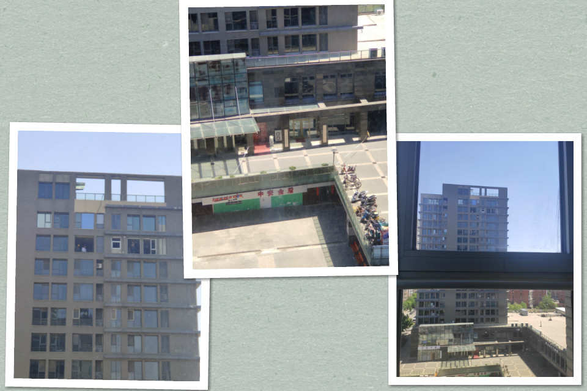

# 19周 5.6-5.12

## 判定一件危险的事要不要做

公司对面的那栋楼的顶上两层在休整窗户，下面拉着警戒线，行人少有绕行的，大多直接穿行而过。

评价一件危险的事我想应该从三个角度来看，一次发生的概率，发生后影响大小，事件经历的次数。

对于这个高楼层窗户施工，可能掉下东西砸到行人来说。发生的概率是较小的，需要恰好掉下东西，又需要有人经过。但是发生后影响是极大的，很可能是性命攸关的。不过对于行人来说，可能只是今天经过这里一次而已，事件经历次数很小，发生概率又小，所以冒险通过我还能理解他们。不过对于施工方来说，他们是一直在施工的，下面如果一直有行人经过，那就相当于一直在做实验，整体结果危险程度大大提高，他们更应该有动力加强警戒才对。况且不是这一个地方，一个装修公司肯定有很多这种项目在进行。

## 怎么看总有人搞小动作

之前对于这种情况一直是嗤之以鼻的，也特别讨厌这种人，想远离他们。后来经过点拨想到，这种人是躲不开的，有很多很多，到哪里都有可能有，我要想的是怎么和他们打交道，怎么和他们相处，怎么在有他们的环境工作生活，怎么掌控他们，而不是逃离。

## 乳化

表面活性剂的基本特点：渗透、润湿、乳化-分散、增溶

分散指固体分散开，乳化指液体分散开（比如洗涤灵对油的作用）

（表面张力：液体反对表面拉伸的力）

原来这就是乳化。